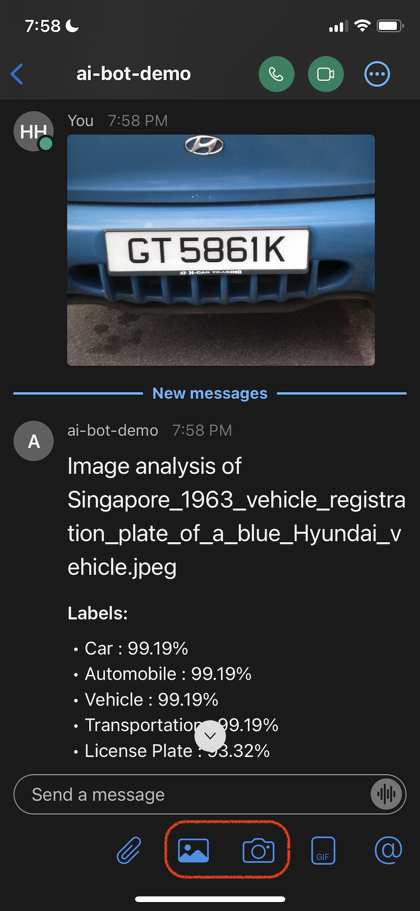

# Build a Serverless AI Bot using Cisco Webex, Amazon Rekognition, AWS Lambda and AWS CDK

*"Nearly 40% of internet users worldwide prefer interacting with chatbots than virtual agents, and with major industries including retail and healthcare turning to digital technology, chatbots will likely increase in popularity moving forward."*, according to [Business Insider Intelligence](https://www.businessinsider.com/chatbot-market-stats-trends). 

Popular messaging platforms like Facebook, WhatsApp, Slack and Cisco Webex gives you the possibility to use bots in the backend for automated interactions and business processes. These messaging platforms are widely used and available via native applications on desktop and mobile devices. Companies can thus focus on implementing their business logic in a bot without worrying about developing their own chat client UI. There are various platforms that you can use to build and host bots on Amazon Web Services (AWS), for example, [Amazon Lex](https://aws.amazon.com/lex), [Amazon EC2](https://aws.amazon.com/ec2), and [AWS Lambda](https://aws.amazon.com/lambda). One of the motivations to use the cloud for bots, is that you can leverage an array of AI services in the business process and perform actions like persisting the transaction in a database, triggering an AWS Lambda function, sending an email notification or sending an SMS notification. The following diagram shows an example of such a bot. The clients interact with the bot via a webhook on the messaging platform. The bot's business logic uses AWS Artificial Intelligence (AI) services and then other AWS services like databases to persist data or notification services for further action.


To meet our customers where they are on their machine learning journey and help them achieve specific business outcomes, AWS provides the broadest and most complete set of machine learning and artificial intelligence services for builders of all levels of expertise. The following diagram shows the AWS machine learning stack.


- At the top layer are our AI Services, that allow developers to easily add intelligence to any application without needing ML skills. The pre-trained models provide ready-made intelligence for your applications and workflows to help you do things like personalizing the customer experience, forecasting business metrics, translating conversations, extracting meaning from documents and more. 

- At the middle layer is Amazon SageMaker, which provides every developer and data scientist the ability to build, train, and deploy machine learning models at scale. It removes the complexity from each step of the machine learning workflow so you can more easily deploy your machine learning use cases, anything from predictive maintenance to computer vision to predicting customer behaviors. Business Analysts and Application Developers can also build their own model and add intelligence to their applications using SageMaker Canvas with no ML skills. 

- And at the bottom layer, expert practitioners can develop on the framework of their choice as a managed experience in Amazon SageMaker or use the AWS Deep Learning AMIs (Amazon machine images), that are fully configured with the latest versions of the most popular deep learning frameworks and tools.


## Solution Overview

In this tutorial, we implement a serverless Bot using AWS Lambda and Amazon API Gateway. AWS Cloud Development Kit (AWS CDK) is used for the infrastructure deployment as shown in the following architecture diagram.


[Amazon Rekognition](https://aws.amazon.com/rekognition/) offers pre-trained and customizable computer vision (CV) capabilities to extract information and insights from your images and videos. With the architecture above, customers can extend it to implement computer vision use cases, like:

- Capture number plates of vehicles that breach parking rules
- Sentiment analysis based on emotions on faces
- Automatic provisioning of industrial equipments using picture of serial number or MAC address

In this example, we implement the vehicle number plate capture use case, where we detect the vehicle number plate of parking rules offenders using Amazon Rekognition and store it into an [Amazon DynamoDB](https://aws.amazon.com/dynamodb/) table for further processing. An example of the post-processing activity could be sending a daily list of car plates to the authorities to enforce respective penalties. The post-processing step is out of scope of this tutorial.


In this post, we walk you through the following steps:

1. Install the [AWS Command Line Interface](http://aws.amazon.com/cli) (AWS CLI) and [AWS CDK v2](https://docs.aws.amazon.com/cdk/v2/guide/getting_started.html) on your local machine
2. Setup Cisco Webex
3. Create Bot application on Cisco Webex
4. Clone and configure the AWS CDK application
5. Initialize and deploy application with AWS CDK
6. Setup webhook
7. Test the Bot using Cisco Webex


So, let's get started...


## Prerequisites:

You should have the following prerequisites:

- An [AWS account](https://console.aws.amazon.com/console/home?nc2=h_ct&src=header-signin)
- [AWS CLI v2](https://docs.aws.amazon.com/cli/latest/userguide/install-cliv2.html)
- Python 3.6 or later
- node.js 14.x or later
- [AWS CDK v2](https://docs.aws.amazon.com/cdk/v2/guide/getting_started.html)

The estimated cost to complete this post is less than $1, assuming you leave the resources running for 8 hours. Make sure you delete the resources you create in this post to avoid ongoing charges.


## Install the AWS CLI and AWS CDK on your local machine

If you do not have AWS CLI already on your local machine, install it using this [install guide](https://docs.aws.amazon.com/cli/latest/userguide/getting-started-install.html) and configure using this [configuration guide](https://docs.aws.amazon.com/cli/latest/userguide/cli-chap-configure.html).

Install the AWS CDK Toolkit globally using the following node package manager command:

```none
npm install -g aws-cdk-lib@latest
```

Run the following command to verify the correct installation and print the version number of AWS CDK:

```bash
cdk --version
```


## Setup Cisco Webex 

Create account on Cisco Webex:

-  Go to https://web.webex.com/sign-in and create a new account. If you already have an account, you can sign in instead of creating a new account.
-  Type in your email address. Check your email inbox for a confirmation email from Cisco Webex. In the email you will find a link to activate your account. 
-  Follow the link to activate your account and create a password.


You can use Cisco Webex through your web browser using this [link](https://web.webex.com). However, for best experience download and install the desktop and mobile applications on this [link](https://www.webex.com/downloads.html).


### Create Bot application on Cisco Webex

We create a Bot application on Cisco Webex developer page:

-  Go to https://developer.webex.com/my-apps/new and click on **Create a Bot** button. Type in the Bot name, Bot username, Description.


- Click **Add Bot** button.


- Copy and save the `Bot access token` and `Bot username`. We need them in the next step.

- Feel free to explore Cisco Webex developer [documentation](https://developer.webex.com/docs/platform-introduction)


## Clone and configure the AWS CDK application

On your local machine, clone the AWS CDK application with the following command:

```shell
git clone https://github.com/aws-samples/cisco-webex-ai-bot-with-amazon-rekognition.git
```


Navigate into the project folder:

```
cd cisco-webex-ai-bot-with-amazon-rekognition
```


Before we configure the application, let's review the directory structure:

```shell
.
├── CODE_OF_CONDUCT.md
├── CONTRIBUTING.md
├── LICENSE
├── README.md
├── app.py
├── cdk.json
├── cisco_webex_ai_bot_with_amazon_rekognition
│   ├── __init__.py
│   └── cisco_webex_ai_bot_with_amazon_rekognition_stack.py
├── images
│   ├── 01_architecture.png
│   ├── ...
├── lambda
│   ├── bot.py
│   └── configs.py
├── requirements-dev.txt
├── requirements.txt
├── source.bat
├── tests
│   ├── __init__.py
│   └── ...
├── webhook_delete.py
├── webhook_lib.py
└── webhook_setup.py

```

The repository also contains the serverless bot application located under the subfolder `lambda`. The [cdk.json](https://github.com/aws-samples/cisco-webex-ai-bot-with-amazon-rekognition/blob/main/cdk.json) file tells the AWS CDK Toolkit how to run your application.


Set variables `bot_token` and `bot_email_id` in `configs.py` file

```python
stack_name = 'CiscoWebexAiBotWithAmazonRekognitionStack' # Do not modify
region_name='ap-southeast-1' # Change to reflect the region your AWS CLI is configured
bot_token = '' # Insert your Bot's token here
bot_email_id = 'xxxxx@webex.bot' # Replace with your bot's username
bot_webhook_name = 'webex-ai-chatbot-hook' # Change to your desired webhook name
webex_header =  {
                'Authorization': 'Bearer ' + bot_token,
                'Content-Type':'application/json; charset=utf-8',
                }
```


## Initialize and deploy application with AWS CDK

This project is set up like a standard Python project. Create a Python virtual environment using the following code:

```
python3 -m venv .venv
```

Use the following step to activate the virtual environment:

```
source .venv/bin/activate
```

If you’re on a Windows platform, activate the virtual environment as follows:

```
.venv\Scripts\activate.bat
```

After the virtual environment is activated, upgrade pip to the latest version:

```
python3 -m pip install --upgrade pip
```

Install the required dependencies:

```
pip install -r requirements.txt
```

Before you deploy any AWS CDK application, you need to bootstrap a space in your account and the Region you’re deploying into. To bootstrap in your default Region, issue the following command:

```
cdk bootstrap
```

If you want to deploy into a specific account and region, issue the following command:

```
cdk bootstrap aws://ACCOUNT-NUMBER/REGION
```

For more information about this setup, visit [Getting started with the AWS CDK](https://docs.aws.amazon.com/cdk/latest/guide/getting_started.html)


You can now synthesize the [AWS CloudFormation](https://aws.amazon.com/cloudformation/) template for this code:

```
cdk synth
```


At this point, you can deploy the AWS CDK application:

```
cdk deploy
```


You should see a list of AWS resources that will be provisioned in the stack. Enter 'y' to proceed with the deployment.


You can see the progress of the deployment on the terminal. It takes around 3 minutes to deploy the stack.


Once deployment is complete, you can see the total deployment time and AWS CloudFormation *Outputs* on the terminal. We use this endpoint in a python script to setup the webhook later in this tutorial.


### CDK application code walkthrough

The CDK main application, [app.py](https://github.com/aws-samples/cisco-webex-ai-bot-with-amazon-rekognition/blob/main/app.py) is creating a CloudFormation stack called `CiscoWebexAiBotWithAmazonRekognitionStack` using the constructs defined in [cisco_webex_ai_bot_with_amazon_rekognition_stack.py](https://github.com/aws-samples/cisco-webex-ai-bot-with-amazon-rekognition/blob/main/cisco_webex_ai_bot_with_amazon_rekognition/cisco_webex_ai_bot_with_amazon_rekognition_stack.py). Read through the comments to see what each block is doing.

First, we import the necessary libraries needed to construct the stack:

```python
from aws_cdk import (
    Duration,
    Stack,
    aws_lambda as _lambda,
    aws_apigateway as apigw,
    aws_iam as iam,
    aws_dynamodb as ddb,
    RemovalPolicy,
    CfnOutput
)
from constructs import Construct

```


Then in the class `CiscoWebexAiBotWithAmazonRekognitionStack`, we define the stack, starting with the [AWS Identity and Access Management](http://aws.amazon.com/iam) (IAM) role and policies for the AWS Lambda function followed by the Lambda function itself and an [Amazon API Gateway](https://aws.amazon.com/api-gateway/) endpoint for the function.

```python
class CiscoWebexAiBotWithAmazonRekognitionStack(Stack):

    def __init__(self, scope: Construct, construct_id: str, **kwargs) -> None:
        super().__init__(scope, construct_id, **kwargs)

        # Instance Role and SSM Managed Policy
        role = iam.Role(self, "AI-Chatbot-Lambda-Policy", assumed_by=iam.ServicePrincipal("lambda.amazonaws.com"))
        role.add_managed_policy(iam.ManagedPolicy.from_aws_managed_policy_name("AmazonRekognitionReadOnlyAccess"))
        role.add_managed_policy(iam.ManagedPolicy.from_aws_managed_policy_name("service-role/AWSLambdaBasicExecutionRole"))        
        
        # Defines an AWS Lambda resource
        my_lambda = _lambda.Function(
            self, 'BotHandler',
            runtime=_lambda.Runtime.PYTHON_3_7,
            code=_lambda.Code.from_asset('lambda'),
            handler='bot.handler',
            role=role,
            timeout=Duration.seconds(30),
            memory_size=512
        )
        
        # Defines an Amazon API Gateway endpoint
        apigw_endpoint = apigw.LambdaRestApi(
            self, 'Endpoint',
            handler=my_lambda
        )

```


Then we define the data store used in the application, that is, [Amazon DynamoDB](https://aws.amazon.com/dynamodb/), followed by the [AWS CloudFormation](https://aws.amazon.com/cloudformation/) output.

```python
        image_details = ddb.Table(
            self, "ImageDetails",
            partition_key=ddb.Attribute(
                name="id",
                type=ddb.AttributeType.STRING
            ),
            sort_key = ddb.Attribute(
                name="createdAt",
                type=ddb.AttributeType.NUMBER
            ),
            encryption=ddb.TableEncryption.AWS_MANAGED,
            removal_policy=RemovalPolicy.DESTROY
        )

        # Write the Amazon DynamoDB table name in the AWS lambda function's environment variable
        # and grant rights to the AWS Lambda function to write data to the table.
        # The environment variable will be used by the AWS lambda function later.
        my_lambda.add_environment("TABLE_NAME", image_details.table_name)
        image_details.grant_write_data(my_lambda)
           
        CfnOutput(scope=self,id="endpoint",value=apigw_endpoint.url)
```


### Bot application code walkthrough

Now let's take a look at the Bot application code, [bot.py](https://github.com/aws-samples/cisco-webex-ai-bot-with-amazon-rekognition/blob/main/lambda/bot.py). The main function that detects the `detect_carplates_local_file` which takes a photo as parameter. It detects car plates using a regular expression. Change this regular expression to match your country's number plate format. See the following code snippet:

```python
def detect_carplates_local_file(photo):

    client=boto3.client('rekognition')
    ddb = boto3.resource('dynamodb')

    # set environment variable
    TABLE_NAME = os.environ['TABLE_NAME']
    table = ddb.Table(TABLE_NAME)

    with open(photo, 'rb') as image:
        response = client.detect_text(Image={'Bytes': image.read()})

    car_plates_detected = []

    for text in response['TextDetections']:
        carplate_match = re.match("[A-Z]{2,3}\s*\d{3,4}\s*[A-Z]{1}",text['DetectedText']) # change this regular expression to match your country's number plate format
        if carplate_match:
            if text['DetectedText'] not in car_plates_detected:
                car_plates_detected.append(text['DetectedText'])
            response = table.put_item(
                Item={
                    'id': str(carplate_match[0]),
                    'createdAt': int(time.time())
                }
            )

    return car_plates_detected
```


The Bot also detects labels using function `detect_labels_local_file` and all texts using function `detect_texts_local_file`. All information found about the image is posted to the Cisco Webex room using function `post_message_to_room`. The main business logic is inside the `handler` function which AWS Lambda runs when invoked through the API gateway. You can implement other business logic in the `handler` function. 


## Setup webhook

By now the Lambda function and API endpoint are set up. Execute the following script to setup the webhook. 

```shell
python3 webhook_setup.py
```

The script will retrieve the target URL from the CloudFormation output called `endpoint` and create a webhook using the URL.

Alternatively, you can create the webhook manually using the interactive interface on the [Webhooks API documentation](https://developer.webex.com/docs/api/v1/webhooks). The following screenshot shows the webhooks API endpoints documentation.


You can try the APIs on the documentation page itself. Click on this [link](https://developer.webex.com/docs/api/v1/webhooks/list-webhooks) to see the `List Webhooks` API endpoint details. Use your `Bot's access token` instead of your personal token on the interactive interface by toggling the `Authorization` radio button and inserting the token next to `Bearer` as shown in the following screenshot. Then click on the `Run` button.


## Test the Bot using Cisco Webex

Using the Cisco Webex desktop application, search for the Bot by it's name and send it a message. In the conversation space, attach a picture and send the message. Please use a car plate picture if possible. The application will match the number plate format of vehicles in Singapore. Please change the regular expression in the function `detect_carplates_local_file` in [bot.py](https://github.com/aws-samples/cisco-webex-ai-bot-with-amazon-rekognition/blob/main/lambda/bot.py).

Once the picture is posted to the room, the Bot will be triggered via the webhook. The Bot will retrieve the picture from the Cisco Webex and send it for analysis to Amazon Recognition. Then the Bot returns the results by posting a message using the Cisco Webex [messages API](https://developer.webex.com/docs/api/v1/messages) endpoint as shown in the following diagram. Notice that the car plate was detected.


Using the Mobile application, you can take a picture with your camera or attach one from your picture library. See buttons highlighted in red in the following image.


<p align="center">
  
</p>


## Clean up

To avoid unnecessary cost, clean up all the infrastructure created with the following command on your workstation:

```shell
cdk destroy
```


Also, delete the webhook for the Cisco Webex Bot:

```shell
python3 webhook_delete.py
```


## Conclusion

As demonstrated in this tutorial, you can use AWS CDK to deploy a serverless AI bot for Cisco Webex using AWS Lambda which makes calls to Amazon Rekognition for image analysis and stores data in Amazon DynamoDB. With Cisco Webex, no development is needed for the client application and integration with AWS services is seamless through the use of webhooks. You can now build your own chat application on AWS. 

We invite you to test the solution and contribute to the project on [GitHub](https://github.com/aws-samples/cisco-webex-ai-bot-with-amazon-rekognition).


## **License summary**

This sample code is made available under a modified MIT license. See the LICENSE file. Also the car pictures used in the examples are licensed under [Creative Commons](https://en.wikipedia.org/wiki/Creative_Commons). Follow the links for [first picture](https://commons.wikimedia.org/wiki/File:Singapore_1990_vehicle_registration_plate_of_a_silver_Ford_Focus.jpg) and [second picture](https://commons.wikimedia.org/wiki/File:Singapore_1963_vehicle_registration_plate_of_a_blue_Hyundai_vehicle.jpg).

